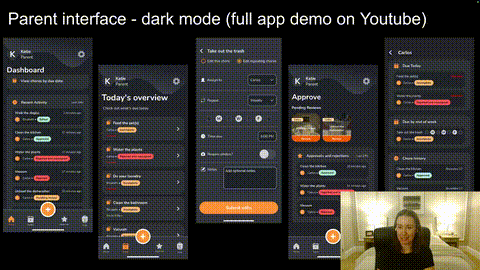

### View Portfolio [HERE](https://my-portfolio-sage-zeta-21.vercel.app/) 📱

# Hi, I'm Katie 👋

I’m a Software Engineer who learned to code and never looked back! I specialize in front-end and mobile development, specifically with React / React Native and JavaScript frameworks.

My background in both fitness and executive support has always centered on helping others succeed. In these roles, I relied on a wide range of software tools and became increasingly interested in how those systems were built. This curiosity ultimately pushed me toward pursuing software engineering, where I can create my own solutions to help others.

I graduated from Coding Dojo at Colorado Technical University in July 2025 with 3 full stacks under my belt. Since then, I’ve built many projects including a cross platform mobile application with 2 distinct interfaces and dozens of screens to handle complex task management workflows. Built for a client alongside a backend engineer and a UI/UX designer, this project highlights my work as the front-end engineer. It showcases my technical expertise and my ability to deliver robust, feature-rich solutions through effective collaboration. Check out the project below!

## 🛠 Technical Skills
**LANGUAGES:** JavaScript (ES6), HTML5, CSS3, Python, SQL, Java

**FRAMEWORKS & LIBRARIES**: React Native, Expo, React, Node.js, Express, Vite, NativeWind, TailwindCSS, Flask, Spring Boot, Bootstrap

**DATABASES:** MongoDB, MySQL

**CLOUD & TOOLS:** EAS Build, Xcode, Android Studio, Figma, Cloudflare R2, Render, Vercel, Git, GitHub, Postman

## 📱 Featured Project
### Track My Chores
A full-stack mobile app for managing household chores with parent and child interfaces

👉 [View Repository](https://github.com/DojoEngineers/chore-tracker)

## 🌐 Connect with me
- Portfolio: https://my-portfolio-sage-zeta-21.vercel.app/
- LinkedIn: https://www.linkedin.com/in/katiechickering/
- YouTube: https://www.youtube.com/@katiechickering
