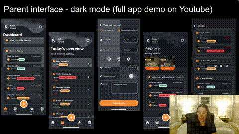

### View Portfolio [HERE](https://katie-chickering-portfolio.vercel.app/) 📱

# Hi, I'm Katie 👋

I’m an Engineer who thrives at the intersection of deep technical problem-solving and customer success. I specialize in front-end and mobile development, with a heavy focus on React Native, React and TypeScript.

My background in fitness and executive support has always been about helping others succeed. In those roles, I became the technical go-to for my teams, which sparked a curiosity about how software systems are built from the ground up. That curiosity led me to pursue a rigorous engineering foundation so I could solve the complex technical hurdles that standard support can’t reach.

I graduated from Coding Dojo in July 2025 with three full stacks under my belt (Python, JavaScript, and Java). Since then, I’ve architected and launched a cross-platform mobile application featuring dozens of screens and complex workflows. Working alongside a back-end engineer and a UI/UX designer, I served as the front-end engineer triageing bugs, managing integrations, and collaborating across teams to deliver a feature-rich product.

I’m now looking to use my engineering background to bridge the gap between technical complexity and the people who use the software. Check out my projects below!

## 🛠 Technical Skills
**APIs $ WEB TECHNOLOGIES:** REST APIs | JSON | HTTP | Postman | HTML5 | CSS3

**LANGUAGES:** JavaScript | TypeScript | Python | SQL | Java

**FRAMEWORKS & LIBRARIES:** React Native | Expo | React | Next.js | Node.js | Express

**DATABASES & TOOLS:** MongoDB | MySQL | Git | GitHub | Jira | Salesforce | Vercel

## 📱 Featured Project
### Track My Chores
A full-stack mobile app for managing household chores with parent and child interfaces

👉 [View Repository](https://github.com/DojoEngineers/chore-tracker)

## 🌐 Connect with me
- Portfolio: https://katie-chickering-portfolio.vercel.app/
- LinkedIn: https://www.linkedin.com/in/katiechickering/
- YouTube: https://www.youtube.com/@katiechickering/
